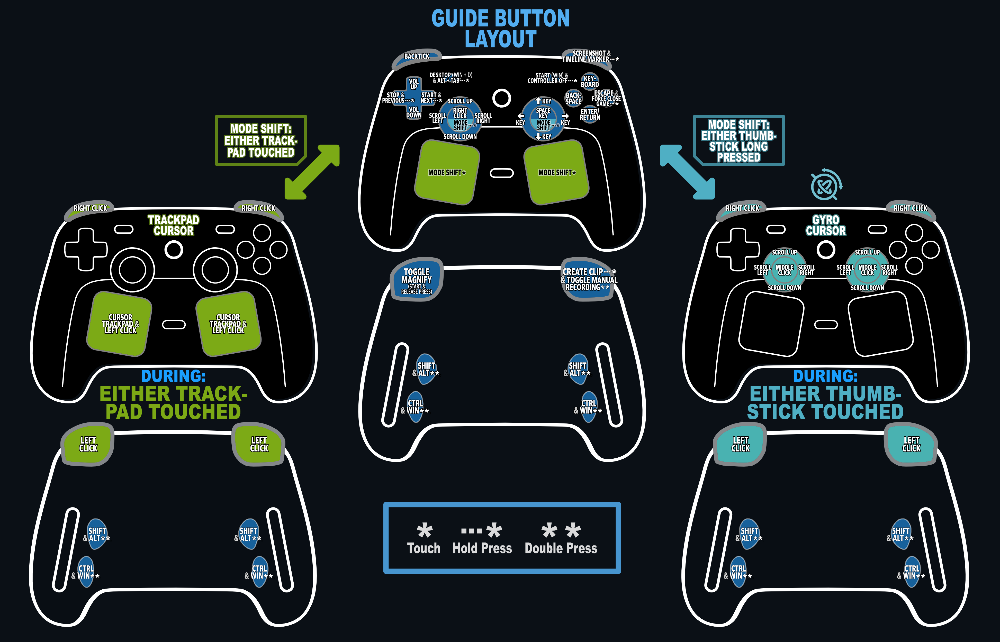
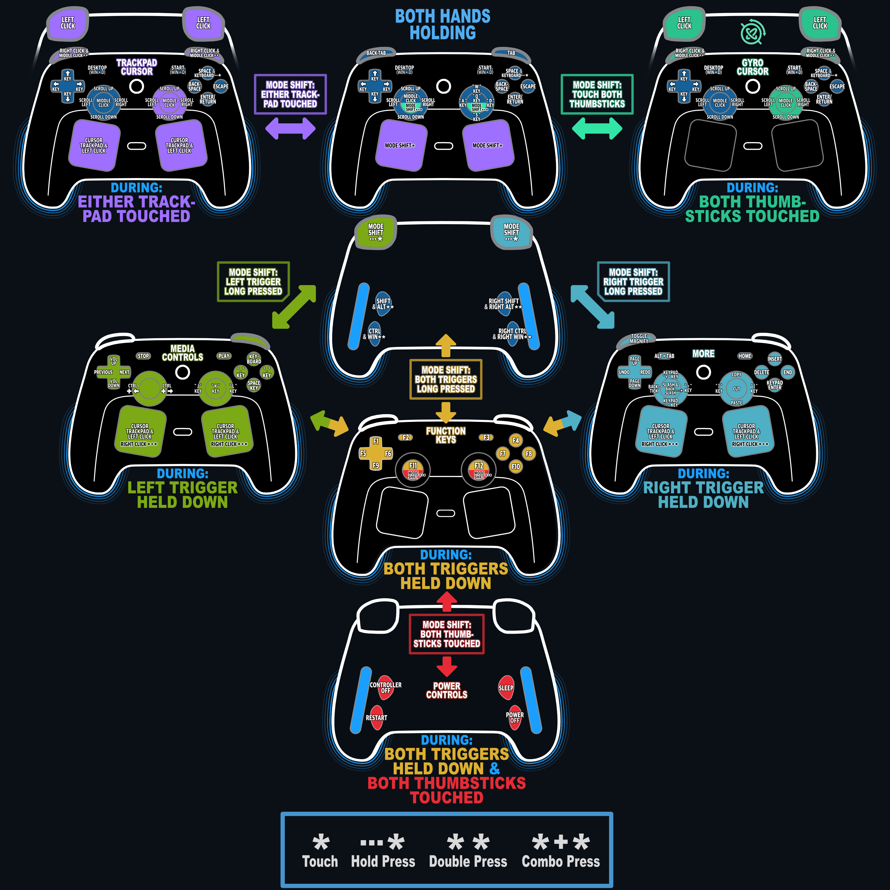
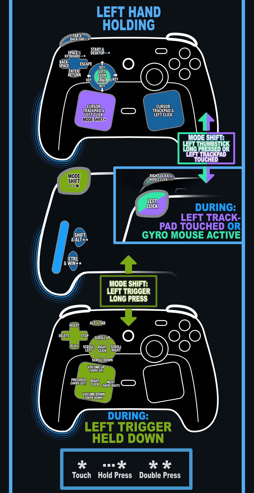
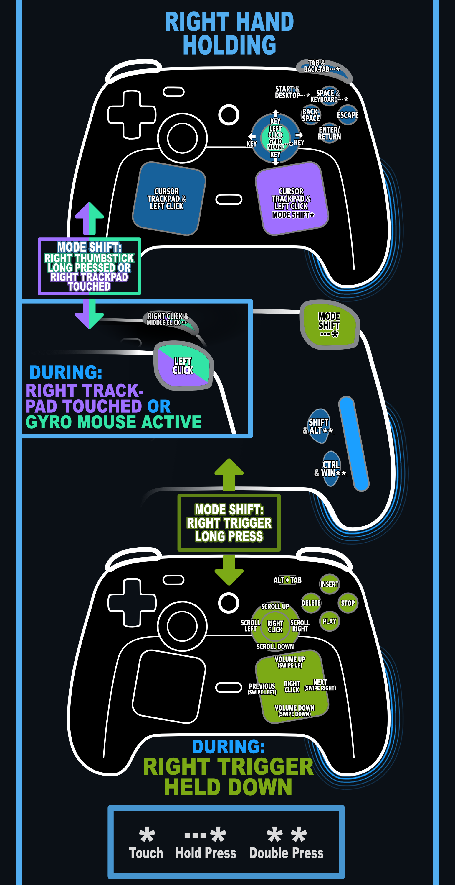
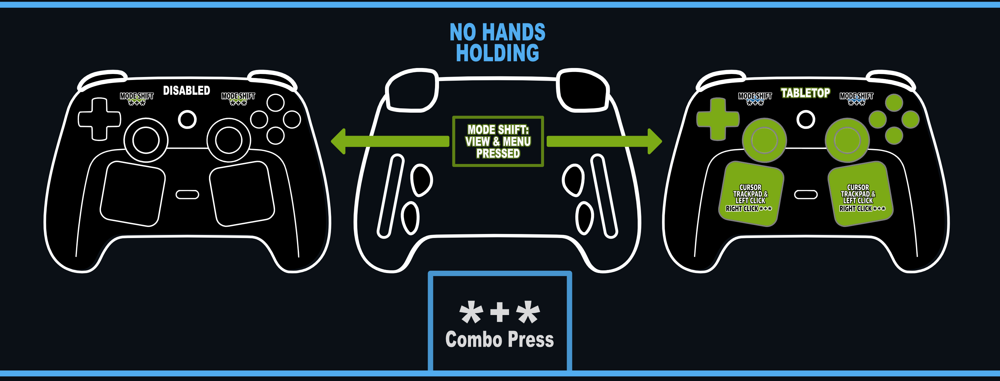

# Cawnsole Steam Input Layouts

A small collection of Steam Input controller mappings (currently only for the second generation Steam Controller) to get the most out of a gamepad while also remaining intuitive and natural feeling to use.

*Some inputs are still "unset", but highlighted or mentioned in documentation. These inputs are ones I think would still feel intuitive, but I have not currently mapped it to anything.*

## Guide/ Chord Button Layout

| ***DOWNLOAD*** |
| --- |
| Direct Steam Links |
| <steam://controllerconfig/443510/3738257806> |
| <workshop://3738257806> |
| <https://cdn.steamusercontent.com/ugc/14088093969509472123/903E187A140E78BA404C97B5A6424E769881D04E/> |
|  |
| [Direct Repo Link](<./Cawnsole Guide Layout/Cawnsole_Guide_Layout.vdf>) |

The Guide Button Layout will change the back buttons (L1, L2, R1, R2) into mouse clicks to accommodate the use of trackpad or gyro for cursor control:

| Trackpad Touched | Thumbstick Long Press + Touch |
| --- | --- |
| Trackpad Cursor | Gyro Cursor |

The changes will stop taking effect once the corresponding input isn't being touched *(you take your finger off the trackpad or thumbstick)*.

*[Spreadsheet view can be found here.](./Tables/Guide/Guide.xlsx)*

## Desktop Layout

| ***DOWNLOAD*** |
| --- |
| Direct Steam Links |
| <steam://controllerconfig/413080/3739868394> |
| <workshop://3739868394> |
| <https://cdn.steamusercontent.com/ugc/14505408255306668355/7FC7BA18E93023E63AE7E3A222104682E0D722AE/> |
|  |
| [Direct Repo Link](<./Cawnsole Destop Layout/Cawnsole_Desktop_Layout.vdf>) |

*The full size [Master Map Image can be found here.](./Maps/Desktop/Master-Map.png)*

The Desktop Layout supports 4 different types of use depending on how the controller is detected as held; 

1. Both Hands
2. Left Hand
3. Right Hand
4. No Hands (not being held). 

### Both Hands Holding

***The default state.*** 

Hold each trigger to change the input mode;

| Left Trigger | Both Triggers | Right Trigger |
| --- | --- | --- |
| Media Inputs | Function Inputs | More Inputs |
| | Power Inputs (touch both thumbsticks) | |

*[Spreadsheet view can be found here.](./Tables/Desktop/Both-Hands.xlsx)*

*Right Windows button is only available using the edited Direct Repo Link above.*

### Left Hand Holding

Hold the trigger to change the input mode;

| Left Trigger |
| --- |
| More Inputs |

*[Spreadsheet view can be found here.](./Tables/Desktop/Left-Hand.xlsx)*

### Right Hand Holding

Hold the trigger to change the input mode;

| Right Trigger |
| --- |
| More Inputs |

*[Spreadsheet view can be found here.](./Tables/Desktop/Right-Hand.xlsx)*

### No Hands Holding

Simultaneously press the View & Menu button to change input mode;

| View + Menu |
| --- |
| Tabletop Inputs |

*[Spreadsheet view can be found here.](./Tables/Desktop/No-Hands.xlsx)*
